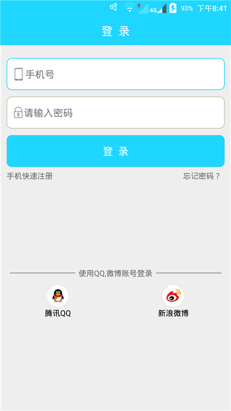
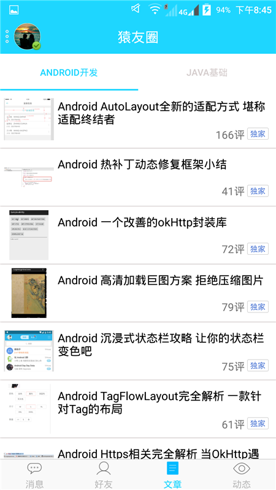
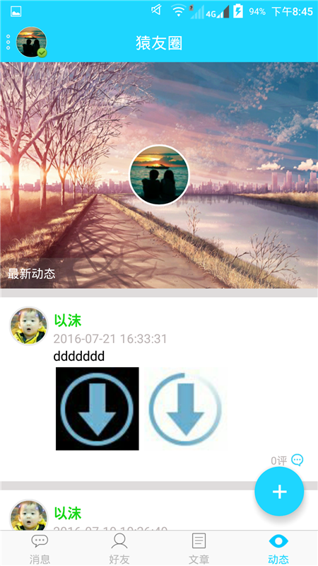
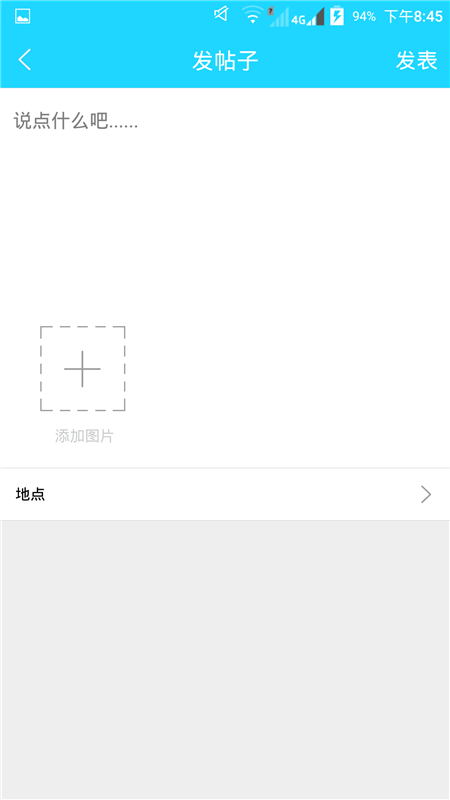
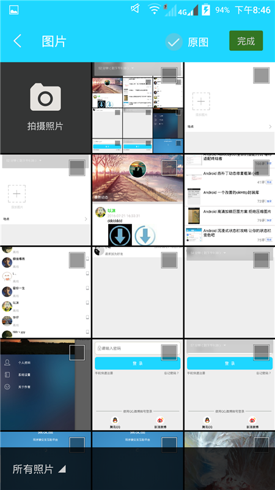
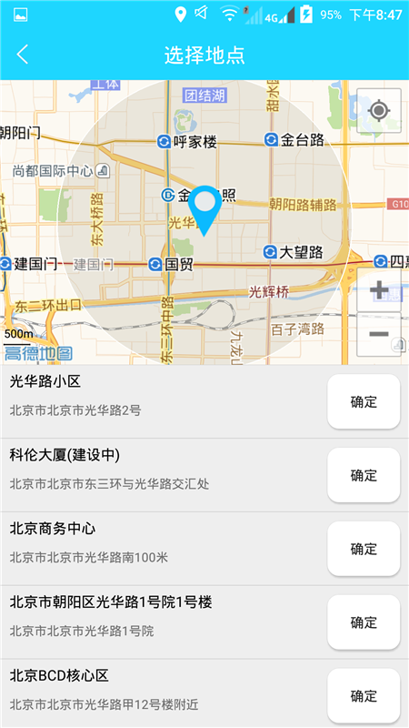
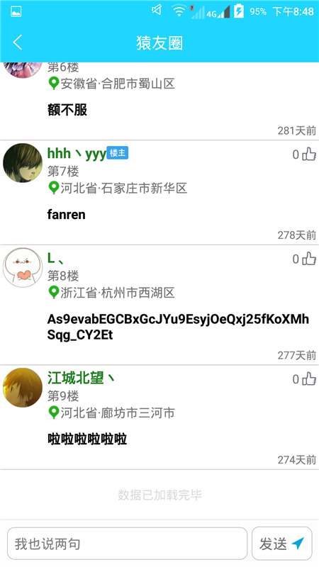
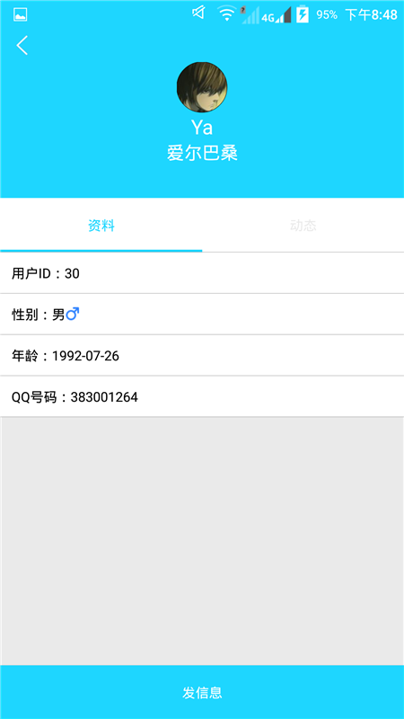
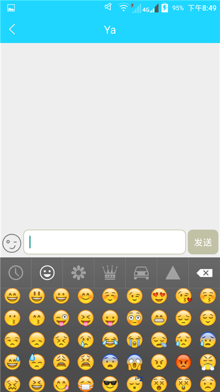
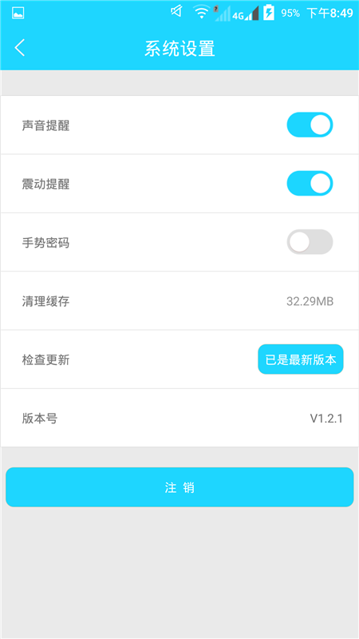

# yyquan

 

开源一个自己去年写的基于Xmpp协议的即时通讯社交软件 (客户端+服务端) 
 
本项目仅供参考，对于正在学习Xmpp以及javaweb后台的同学，可以看一下。 
做这个项目纯属个人兴趣爱好，所以即时通讯做的不是很深，只是简单的实现了功能。（查询，添加好友，聊天等） 另外要提的一点，源生的openfire很好，但并不能满足所有业务，所以需要对openfire进行二次开发。 

 
 
如果你觉得还不错，可以给个star，支持下，谢谢了！

# 项目效果图
 
PNG
 
 

 

 

 
 
GIF
 

 
模拟器录制显示的效果不是太好且只展示了聊天功能，其他功能自行下载体验。
 
# APK
[apk下载](https://github.com/jiangzehui/yyquan/blob/master/apk/yyq1.2.2.apk)
 或者前往各大应用市场（应用宝，360，百度等）搜索 **猿友圈** 下载 如无法测试，说明服务器到期了。请自行搭建服务端，搭建过程遇到任何问题可以联系我 email:jianghui1992@vip.qq.com
 
# 用到的三方库
## 客户端
### 注解
compile 'com.jakewharton:butterknife:7.0.1' 

### 网络请求
compile 'com.loopj.android:android-async-http:1.4.9'  

### 图片处理
compile 'com.squareup.picasso:picasso:2.5.2'  
compile 'com.commit451:PhotoView:1.2.4' 

### 即时通讯
asmack-android-6 

### Other
高德地图 
ShareSDK 
SMSSDK 
信鸽推送 

## 服务端
### 即时通讯
openfire_3_10_3 

### 数据库
mysql 

### Other
Tomcat 
JavaWeb 

# 服务端安装
1.安装 mysql+tomcat6.0 
2.初始化数据库文件 
3.将service服务端代码部署到tomcat(我上传的是源码，需要自己编译一下哈) 
4.openfire安装部署 http://jingyan.baidu.com/article/2c8c281df16ad30008252ae4.html 
5.修改一下openfire数据表ofuser表name字段的长度（代码：alter table ofuser modify column name varchar(200);） 
6.启动tomcat与openfire 
ps: IP地址记得要改成你自己的，由于是去年写的项目，Android6.0并没有做适配，请谅解，如果遇到报错，请手动打开所有权限。 

# 推荐阅读
1.模仿掌上英雄联盟能力分析效果  https://github.com/jiangzehui/polygonsview  

2.此项目基于Retrotfit2.1+Material Design+ijkplayer开发的一个APP。目前已有的功能是 新闻，gif动图，视频播放 
https://github.com/jiangzehui/MD 
# About me

An android little developer in HeBei. 
If you have any suggestions, let me know. 
email:jianghui1992@vip.qq.com

# License

Copyright 2016 jiangzehui

Licensed under the Apache License, Version 2.0 (the "License"); you may not use this file except in compliance with the License. You may obtain a copy of the License at

http://www.apache.org/licenses/LICENSE-2.0

Unless required by applicable law or agreed to in writing, software distributed under the License is distributed on an "AS IS" BASIS, WITHOUT WARRANTIES OR CONDITIONS OF ANY KIND, either express or implied. See the License for the specific language governing permissions and limitations under the License.
